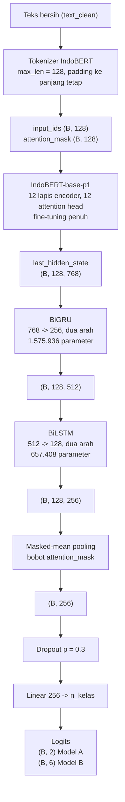
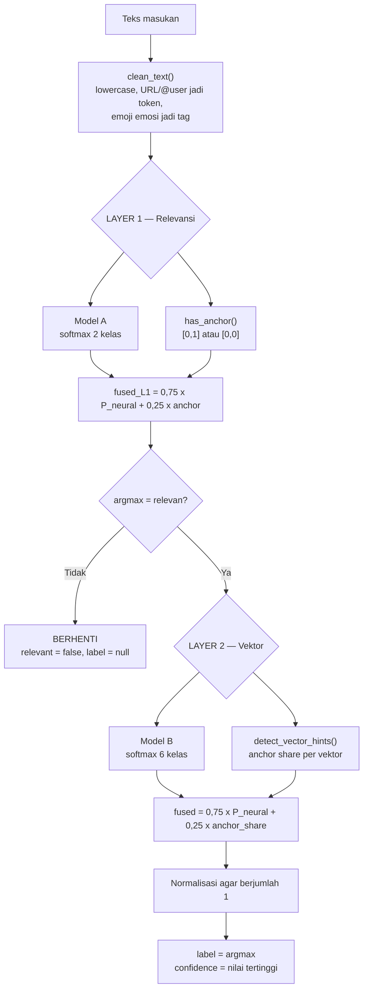

# Bahan Penulisan §3.8 — Arsitektur Triple-Hybrid & Landasan Teori

> **Cara pakai:** dokumen ini bahan mentah untuk disunting, bukan untuk ditempel apa adanya ke skripsi.
> Setiap angka di sini punya padanan baris kode atau sumber pustaka yang dicantumkan, jadi semuanya
> dapat Anda verifikasi ulang sebelum masuk dokumen.
>
> Dibuat 30 Juli 2026. Sumber kode: `src/phase9_model_a_layer1.py`, `src/phase9_model_b_layer2.py`,
> `src/anchor_patterns.py`, `dashboard/backend/app/pipeline.py`.

---

## 1. Arsitektur lapisan Triple-Hybrid



Struktur ini identik untuk kedua model; satu-satunya perbedaan ada pada dimensi keluaran lapisan
linear (`src/phase9_model_a_layer1.py:61-80` dan `src/phase9_model_b_layer2.py:84-103`).

### 1.1 Jejak dimensi tensor

Diturunkan langsung dari `forward()` kedua model. `B` = ukuran batch (16 saat pelatihan).

| Tahap | Bentuk keluaran | Dari mana angkanya |
|---|---|---|
| Tokenisasi | `(B, 128)` | `--max-len` default `128` |
| `bert(...).last_hidden_state` | `(B, 128, 768)` | `hidden_size` di `config.json` IndoBERT |
| `bigru(seq)` | `(B, 128, 512)` | `GRU(768, 256, bidirectional=True)` → 2 × 256 |
| `bilstm(g)` | `(B, 128, 256)` | `LSTM(2*256, 128, bidirectional=True)` → 2 × 128 |
| masked-mean pool | `(B, 256)` | `(l * mask).sum(1) / mask.sum(1).clamp(min=1e-9)` |
| `classifier(dropout(pooled))` | `(B, 2)` / `(B, 6)` | `Linear(2*128, n_classes)` |

### 1.2 Ukuran parameter

| Komponen | Parameter | Catatan |
|---|---|---|
| IndoBERT-base-p1 | 124.500.000 | dari model card resmi |
| BiGRU (768→256, dua arah) | 1.575.936 | dihitung dari `nn.GRU` PyTorch |
| BiLSTM (512→128, dua arah) | 657.408 | dihitung dari `nn.LSTM` PyTorch |
| Linear Model A (256→2) | 514 | |
| Linear Model B (256→6) | 1.542 | |
| **Kepala non-BERT, Model B** | **2.234.886** | ≈ 1,8% dari total |

Angka terakhir berguna untuk argumen di sidang: **lebih dari 98% kapasitas model ada di IndoBERT**.
Lapisan rekuren adalah kepala ringan di atas encoder, bukan komponen yang memikul beban utama.

---

## 2. Cara kerja tiap komponen

Bagian ini menjawab "bagaimana cara kerjanya", bukan sekadar "apa susunannya". Silakan disunting
sesuai gaya bahasa Anda.

### 2.1 IndoBERT sebagai pengekstraksi representasi kontekstual

IndoBERT-base-p1 adalah model bahasa berbasis Transformer yang mengikuti rancangan BERT
(Devlin dkk., 2019), yang inti komputasinya adalah mekanisme *self-attention* (Vaswani dkk., 2017).
Berbeda dari *word embedding* statis, setiap token direpresentasikan dengan memperhitungkan seluruh
token lain dalam kalimat secara serentak dan dua arah, sehingga satu kata yang sama memperoleh vektor
berbeda bergantung konteksnya. Sifat ini penting bagi penelitian ini karena istilah domain seperti
"gacor" atau "rungkad" hanya bermakna ancaman siber pada konteks tertentu.

Konfigurasi resmi model (`config.json`):

| Parameter | Nilai |
|---|---|
| `num_hidden_layers` | 12 |
| `num_attention_heads` | 12 |
| `hidden_size` | 768 |
| `intermediate_size` | 3.072 |
| `vocab_size` | 50.000 |
| `max_position_embeddings` | 512 |

Model dipralatih atas korpus **Indo4B** berukuran **23,43 GB** teks berbahasa Indonesia yang dihimpun
dari media sosial, blog, berita, dan laman web (Wilie dkk., 2020). Perbedaan jumlah parameter terhadap
BERT-base bahasa Inggris (124,5 juta berbanding sekitar 110 juta) berasal dari kosakata yang lebih
besar: 50.000 × 768 ≈ 38,4 juta parameter *embedding*, dibanding sekitar 23,4 juta pada BERT-base.

Penelitian ini menerapkan **fine-tuning penuh**, artinya bobot seluruh 12 lapis encoder ikut diperbarui
selama pelatihan, bukan dibekukan sebagai pengekstraksi fitur statis.

> **Catatan panjang masukan.** Model mendukung hingga 512 posisi, tetapi penelitian ini memotong pada
> 128 token. Ini keputusan efisiensi: biaya self-attention tumbuh kuadratik terhadap panjang urutan,
> sementara mayoritas komentar dan tweet jauh lebih pendek dari 128 token.

### 2.2 BiGRU sebagai peringkas urutan

*Gated Recurrent Unit* (Cho dkk., 2014) memproses urutan token secara berurutan dengan dua gerbang:
gerbang **update** yang menentukan seberapa banyak keadaan lama dipertahankan, dan gerbang **reset**
yang menentukan seberapa banyak keadaan lama diabaikan saat menghitung kandidat keadaan baru. Kedua
gerbang ini mengatasi masalah *vanishing gradient* pada RNN sederhana tanpa memerlukan sel memori
terpisah.

Varian **dua arah** mengikuti gagasan *bidirectional recurrent neural network* (Schuster & Paliwal,
1997): satu jalur membaca urutan dari awal ke akhir, satu jalur lagi dari akhir ke awal, lalu keluaran
keduanya digabung. Karena itu dimensi keluarannya menjadi 2 × 256 = 512.

Dibanding LSTM, GRU memakai tiga gerbang alih-alih empat sehingga jumlah parameternya lebih sedikit
pada dimensi yang sama, dengan performa yang pada banyak tugas sebanding (Chung dkk., 2014).

### 2.3 BiLSTM serial di atas BiGRU

*Long Short-Term Memory* (Hochreiter & Schmidhuber, 1997) menambahkan **sel memori** yang dikendalikan
tiga gerbang: *input*, *forget*, dan *output*. Sel memori inilah yang memungkinkan informasi bertahan
melintasi rentang token yang lebih panjang. Penerapan LSTM dua arah pertama kali dilakukan oleh Graves
dan Schmidhuber (2005). Keluaran dua arah pada penelitian ini berdimensi 2 × 128 = 256.

Dalam arsitektur ini BiLSTM tidak bekerja langsung atas keluaran IndoBERT, melainkan atas **ringkasan
yang sudah dihasilkan BiGRU**. Susunan serial demikian dimaksudkan agar terjadi penyempitan representasi
bertahap, yaitu 768 → 512 → 256, sebelum diringkas menjadi vektor kalimat.

> **Batas klaim yang jujur.** Susunan serial BiGRU lalu BiLSTM adalah **keputusan rancangan** pada
> penelitian ini, bukan hasil studi ablasi. Repositori tidak memuat eksperimen yang membandingkan
> konfigurasi ini terhadap BiGRU saja, BiLSTM saja, atau klasifikasi langsung dari IndoBERT. Karena
> itu jangan menuliskan klaim bahwa susunan ini "terbukti lebih baik"; cukup nyatakan sebagai pilihan
> rancangan beserta alasannya. Bila penguji menanyakan bukti pembanding, jawaban jujurnya adalah
> ablasi tersebut berada di luar lingkup penelitian ini.

### 2.4 Masked-mean pooling

Keluaran lapisan rekuren masih berupa satu vektor per token, `(B, 128, 256)`, sedangkan pengklasifikasi
membutuhkan satu vektor per kalimat. Peringkasan dilakukan dengan merata-ratakan vektor antar token,
tetapi **hanya atas token nyata**:

```python
mask   = attention_mask.unsqueeze(-1).float()
pooled = (l * mask).sum(1) / mask.sum(1).clamp(min=1e-9)
```

Karena tokenisasi memakai `padding="max_length"`, kalimat pendek disisipi banyak token *padding* sampai
genap 128. Bila rata-rata dihitung tanpa memperhatikan `attention_mask`, vektor token *padding* akan
ikut mengencerkan hasilnya, dan kalimat pendek dirugikan secara sistematis. Pembagi `mask.sum(1)`
memastikan penyebutnya adalah jumlah token nyata, sementara `clamp(min=1e-9)` mencegah pembagian nol.

Pendekatan ini merupakan alternatif dari penggunaan token `[CLS]` yang lazim pada BERT. Dengan
mean-pooling, seluruh posisi token berkontribusi terhadap representasi kalimat, bukan hanya satu token
ringkasan.

### 2.5 Dropout dan lapisan klasifikasi

Sebelum lapisan linear, diterapkan *dropout* dengan probabilitas 0,3 (Srivastava dkk., 2014), yaitu
menonaktifkan sebagian unit secara acak selama pelatihan untuk mengurangi *overfitting*. Lapisan linear
kemudian memetakan vektor berdimensi 256 menjadi dua kelas pada Model A atau enam kelas pada Model B.

### 2.6 Komponen berbasis aturan (anchor)

Komponen ini tidak dilatih dan **hanya aktif pada tahap inferensi**; ia tidak memengaruhi pelatihan
neural sama sekali. Implementasinya di `src/anchor_patterns.py` berupa kumpulan pola regex per vektor,
misalnya `\b(?:gacor|maxwin|rungkad|...)\b` untuk judi dan `\bqris\b` untuk penipuan e-wallet.

Perannya berbeda di tiap lapis:

- **Layer 1** — `has_anchor(text_clean)` mengembalikan nilai biner. Bila teks memuat sekurang-kurangnya
  satu pola domain, vektor anchor bernilai `[0, 1]` yang memihak kelas relevan; bila tidak, `[0, 0]`
  yang bersikap netral.
- **Layer 2** — `detect_vector_hints(text_clean)` menghitung berapa pola yang cocok untuk masing-masing
  vektor, lalu jumlah itu dinormalisasi menjadi *share* proporsional. Vektor yang polanya paling banyak
  muncul memperoleh porsi terbesar.

Sifat penting yang layak ditegaskan di skripsi: **bila teks tidak memuat anchor apa pun, seluruh skor
aturan bernilai nol, sehingga keputusan sepenuhnya diserahkan kepada jalur neural.** Komponen aturan
karenanya berfungsi sebagai penopang, bukan penentu.

Anchor dihitung atas `text_clean`, yaitu masukan yang sama persis dengan yang diterima jalur neural,
agar kedua jalur menilai objek yang identik.

---

## 3. Pipeline dua lapis dan late fusion



Rumusnya sama pada kedua lapis, hanya bentuk skor aturannya yang berbeda:

```
skor_akhir = 0,75 x P_neural + 0,25 x skor_anchor
label      = argmax(skor_akhir)
```

Bobot **0,75 : 0,25 ditetapkan a priori** sebagai keputusan rancangan, bukan hasil penyetelan terhadap
data uji. Ini penting dinyatakan eksplisit: studi ablasi pada `docs/phase9_fusion_ablation.md`
menunjukkan bobot 0,50 : 0,50 justru menghasilkan macro-F1 lebih tinggi (0,9814 berbanding 0,9747),
tetapi nilai itu **ditemukan pada data uji itu sendiri**, sehingga memilihnya berarti melakukan
optimasi terhadap test set. Mempertahankan 0,75 : 0,25 adalah keputusan metodologis yang menjaga
validitas evaluasi, dan justru memperkuat, bukan memperlemah, kualitas penelitian.

---

## 4. Konfigurasi pelatihan

Seluruh nilai di bawah adalah *default* CLI di kedua berkas model dan sudah cocok dengan yang tertulis
di draft §3.8.2 dan §3.8.3.

| Parameter | Nilai | Rujukan |
|---|---|---|
| Optimizer | AdamW | `torch.optim.AdamW` (Loshchilov & Hutter, 2019) |
| Learning rate | 2e-5 | `--lr` |
| Batch size | 16 | `--batch-size` |
| Max length | 128 token | `--max-len` |
| Dropout | 0,3 | `--dropout` |
| Epoch maksimum | 6 | `--epochs` |
| Early stopping patience | 2 | `--patience` |
| Kriteria pemantauan | macro-F1 validasi | `evaluate()` |
| Loss Model A | CrossEntropy berbobot | class weights `[0,60; 2,99]` |
| Loss Model B | CrossEntropy berbobot | `compute_class_weight("balanced")` |
| Perangkat keras | GPU NVIDIA Tesla T4 (Kaggle) | |

Class weight dihitung dengan skema *balanced inverse frequency* dari scikit-learn, yaitu
`n_sampel / (n_kelas x n_sampel_kelas)`. Untuk Model A dengan proporsi relevan 16,7%, rumus itu
menghasilkan sekitar 0,60 untuk kelas tidak relevan dan 2,99 untuk kelas relevan, sesuai angka
`[0,6; 3,0]` yang tertulis di draft.

Model B menyediakan opsi **focal loss** (Lin dkk., 2017) melalui `--loss focal`, tetapi opsi itu
**tidak dipakai** karena weighted CrossEntropy sudah memadai. Boleh disebut sebagai alternatif yang
dipertimbangkan, tetapi jangan ditulis seolah digunakan.

---

## 5. Daftar pustaka

Semua rujukan di bawah sudah diverifikasi venue, tahun, dan halamannya. Sesuaikan formatnya dengan
gaya sitasi yang dipakai skripsi Anda.

| Komponen | Rujukan |
|---|---|
| IndoBERT, Indo4B | Wilie, B., Vincentio, K., Winata, G. I., Cahyawijaya, S., Li, X., Lim, Z. Y., Soleman, S., Mahendra, R., Fung, P., Bahar, S., & Purwarianti, A. (2020). IndoNLU: Benchmark and Resources for Evaluating Indonesian Natural Language Understanding. *Proceedings of AACL-IJCNLP 2020*. arXiv:2009.05387 |
| BERT | Devlin, J., Chang, M.-W., Lee, K., & Toutanova, K. (2019). BERT: Pre-training of Deep Bidirectional Transformers for Language Understanding. *NAACL-HLT 2019*. arXiv:1810.04805 |
| Transformer, self-attention | Vaswani, A., dkk. (2017). Attention Is All You Need. *NeurIPS 2017*. arXiv:1706.03762 |
| RNN dua arah | Schuster, M., & Paliwal, K. K. (1997). Bidirectional Recurrent Neural Networks. *IEEE Transactions on Signal Processing*, 45(11), 2673–2681 |
| LSTM | Hochreiter, S., & Schmidhuber, J. (1997). Long Short-Term Memory. *Neural Computation*, 9(8), 1735–1780 |
| BiLSTM | Graves, A., & Schmidhuber, J. (2005). Framewise phoneme classification with bidirectional LSTM and other neural network architectures. *Neural Networks*, 18(5–6), 602–610 |
| GRU | Cho, K., van Merriënboer, B., Gulcehre, C., Bahdanau, D., Bougares, F., Schwenk, H., & Bengio, Y. (2014). Learning Phrase Representations using RNN Encoder–Decoder for Statistical Machine Translation. *EMNLP 2014*, Doha. arXiv:1406.1078 |
| Perbandingan GRU dan LSTM | Chung, J., Gulcehre, C., Cho, K., & Bengio, Y. (2014). Empirical Evaluation of Gated Recurrent Neural Networks on Sequence Modeling. arXiv:1412.3555 |
| Dropout | Srivastava, N., Hinton, G., Krizhevsky, A., Sutskever, I., & Salakhutdinov, R. (2014). Dropout: A Simple Way to Prevent Neural Networks from Overfitting. *JMLR*, 15, 1929–1958 |
| AdamW | Loshchilov, I., & Hutter, F. (2019). Decoupled Weight Decay Regularization. *ICLR 2019*. arXiv:1711.05101 |
| Weak supervision | Ratner, A., Bach, S. H., Ehrenberg, H., Fries, J., Wu, S., & Ré, C. (2017). Snorkel: Rapid Training Data Creation with Weak Supervision. *VLDB* |
| Focal loss | Lin, T.-Y., Goyal, P., Girshick, R., He, K., & Dollár, P. (2017). Focal Loss for Dense Object Detection. *ICCV 2017* |
| LIME | Ribeiro, M. T., Singh, S., & Guestrin, C. (2016). "Why Should I Trust You?": Explaining the Predictions of Any Classifier. *KDD 2016* |

### 5.1 Peringatan sitasi

> **Ada dua paper berbeda bernama "IndoBERT" yang sama-sama terbit tahun 2020.**
>
> | Paper | Model yang dihasilkan |
> |---|---|
> | **Wilie dkk. (2020)**, IndoNLU, AACL-IJCNLP | `indobenchmark/indobert-*` ← **INI yang dipakai penelitian ini** |
> | Koto dkk. (2020), IndoLEM, COLING | `indolem/indobert-base-uncased` |
>
> Penelitian ini memakai `indobenchmark/indobert-base-p1`, sehingga rujukan yang benar adalah
> **Wilie dkk. (2020)**. BibTeX resmi pada model card juga menunjuk ke paper tersebut. Salah rujuk ke
> Koto dkk. adalah kekeliruan yang lazim terjadi dan wajar ditanyakan penguji.

> **Jangan menafsirkan penanda "p1".** Model card `indobert-base-p1` tidak menjelaskan arti "p1"
> maupun bedanya dengan "p2". Jangan menuliskan penjelasan apa pun mengenai hal itu kecuali Anda
> mengonfirmasinya sendiri dari paper atau repositori IndoNLU. Aman: sebut saja varian yang dipakai
> tanpa menafsirkan penandanya.

---

## 6. Koreksi untuk draft `PI-Draft3_Revisi_Ray Siraj.docx`

### 6.1 Tabel 3.6 (§3.5.2) — empat sel persentase terpasang di baris yang salah

Kolom persentase memuat nilai yang benar, tetapi baris kategori tidak diurutkan menurun sesuai jumlah
sehingga empat baris terakhir bergeser. Angka di bawah dihitung ulang dari
`data/weak_labeled_dataset_v2.csv` (total relevan Snorkel = 9.212):

| Kategori | Jumlah | Tertulis di draft | **Seharusnya** |
|---|---:|---:|---:|
| judi_online_pinjol | 7.486 | 81,3% | 81,3% ✔ |
| penipuan_ewallet_qris | 548 | 5,9% | 5,9% ✔ |
| peretasan_pencurian_identitas | 365 | 5,3% | **4,0%** |
| malware_apk | 214 | 4,0% | **2,3%** |
| deepfake_penipuan_ai | 107 | 2,3% | **1,2%** |
| phishing_rekayasa_sosial | 492 | 1,2% | **5,3%** |

Urutan menurun yang benar: judi (81,3%), e-wallet (5,9%), **phishing (5,3%)**, peretasan (4,0%),
malware (2,3%), deepfake (1,2%).

Perhatikan bahwa **prosa di bawah tabel sudah benar** ("deepfake_penipuan_ai hanya mencakup 1,2%"),
sehingga saat ini tabel bertabrakan dengan narasinya sendiri. Rasio 70:1 yang disebut di prosa juga
sudah benar (7.486 ÷ 107 = 70,0).

Sekalian: draft menulis `phising_rekayasa_sosial`, sedangkan label kanonik yang dipakai di kode dan
di seluruh sistem adalah `phishing_rekayasa_sosial` (dua huruf h).

### 6.2 §3.8.1 — arah dimensi lapisan linear

Kalimat penjelas kode menulis lapisan `clf` "berukuran **keluaran** 256 ke enam kelas". Nilai 256
adalah dimensi **masukan**, bukan keluaran.

Usulan perbaikan:

> …serta lapisan `clf` (linear) yang menerima masukan berdimensi 256 dan menghasilkan enam kelas.

### 6.3 §3.8.1 — argumen `token=HF_TOKEN` pada potongan kode

Potongan kode di draft menulis `AutoModel.from_pretrained(BERT_NAME, token=HF_TOKEN)`, sedangkan
`src/phase9_model_b_layer2.py:88` tidak memakai argumen `token`. Pilih salah satu agar konsisten:
hapus `token=HF_TOKEN` supaya identik dengan repositori, atau pertahankan dengan menambahkan
keterangan bahwa argumen itu penyesuaian saat dijalankan di lingkungan Kaggle.

---

## 7. Ringkasan yang dapat langsung dipakai

Bila butuh satu paragraf padat untuk membuka §3.8.1:

> Arsitektur triple-hybrid yang digunakan menggabungkan tiga komponen dengan peran yang berbeda.
> IndoBERT-base-p1 (Wilie dkk., 2020) berperan sebagai pengekstraksi representasi kontekstual melalui
> 12 lapis encoder Transformer dengan mekanisme self-attention, menghasilkan vektor berdimensi 768 per
> token. Representasi tersebut diteruskan ke lapisan BiGRU dua arah (Cho dkk., 2014; Schuster & Paliwal,
> 1997) yang meringkas urutan token menjadi 512 dimensi, lalu ke lapisan BiLSTM dua arah (Hochreiter &
> Schmidhuber, 1997; Graves & Schmidhuber, 2005) yang menangkap dependensi berjangkauan lebih panjang
> dan menghasilkan 256 dimensi. Keluaran rekuren diringkas menjadi representasi tingkat kalimat melalui
> masked-mean pooling yang memperhitungkan attention mask agar token padding tidak ikut dihitung,
> kemudian melewati dropout sebelum diklasifikasikan oleh lapisan linear. Di luar jalur neural,
> komponen berbasis aturan menghitung kemunculan pola regex khas domain dan digabungkan pada tahap
> inferensi melalui late fusion berbobot 0,75 : 0,25.
